# Diagrama de Clases - Sistema de Gestión de Centro Deportivo

## Descripción General
Este diagrama representa el modelo de dominio completo del sistema de gestión de un centro deportivo, incluyendo usuarios, reservas, servicios, pagos, instalaciones y equipamiento.

## Diagrama de Clases

```mermaid
classDiagram
    %% ========================================
    %% Clases de Usuario
    %% ========================================
    class User {
        <<abstract>>
        -String id
        -String name
        -String email
        -String phone
        -String address
        -boolean active
    }

    class Member {
        -String membershipType
        -LocalDate joinDate
        -int maxEquipmentAllowed
        -int currentEquipmentCount
        +canRentMoreEquipment() boolean
        +rentEquipment() void
        +returnEquipment() void
    }

    class Employee {
        <<enumeration>> Position
        -Position position
        -BigDecimal salary
        -LocalDate hireDate
        -String department
        +calculateYearsOfService() int
    }

    %% ========================================
    %% Enumeraciones de Employee
    %% ========================================
    class Position {
        <<enumeration>>
        MANAGER
        TRAINER
        RECEPTIONIST
        MAINTENANCE
        CLEANING
    }

    %% ========================================
    %% Servicios
    %% ========================================
    class Service {
        <<enumeration>> ServiceType
        -String id
        -String name
        -String description
        -ServiceType type
        -BigDecimal price
        -Duration duration
        -boolean isActive
        +calculateTotalPrice(sessionCount: int) BigDecimal
    }

    class ServiceType {
        <<enumeration>>
        PERSONAL_TRAINING
        PHYSIOTHERAPY
        MASSAGE
        NUTRITION_CONSULTATION
        SWIMMING_LESSONS
    }

    class ServiceReservation {
        <<enumeration>> ServiceStatus
        -String id
        -String memberId
        -String serviceId
        -String employeeId
        -LocalDateTime startTime
        -LocalDateTime endTime
        -ServiceStatus status
        -String notes
        -BigDecimal price
        +overlapsWith(other: ServiceReservation) boolean
        +cancel() void
    }

    class ServiceStatus {
        <<enumeration>>
        PENDING
        CONFIRMED
        COMPLETED
        CANCELLED
        NO_SHOW
    }

    %% ========================================
    %% Instalaciones y Equipamiento
    %% ========================================
    class Facility {
        <<enumeration>> FacilityType
        -String id
        -String name
        -String description
        -FacilityType type
        -int capacity
        -double hourlyRate
        -boolean isActive
        -List~String~ equipmentIds
        +addEquipment(equipmentId: String) void
        +removeEquipment(equipmentId: String) void
    }

    class FacilityType {
        <<enumeration>>
        TENNIS_COURT
        BASKETBALL_COURT
        SWIMMING_POOL
        GYM
        SAUNA
        MEETING_ROOM
    }

    class Equipment {
        <<enumeration>> EquipmentStatus
        <<enumeration>> EquipmentType
        -String id
        -String name
        -String description
        -EquipmentType type
        -EquipmentStatus status
        -LocalDate purchaseDate
        -double purchasePrice
        -String facilityId
        -String currentUserId
        +isAvailable() boolean
        +rentToUser(userId: String) void
        +returnFromUser() void
    }

    class EquipmentStatus {
        <<enumeration>>
        AVAILABLE
        IN_USE
        MAINTENANCE
        DAMAGED
    }

    class EquipmentType {
        <<enumeration>>
        TENNIS_RACKET
        BASKETBALL
        SWIM_CAP
        TOWEL
        LOCKER
        OTHER
    }

    %% ========================================
    %% Reservas
    %% ========================================
    class Reservation {
        <<enumeration>> ReservationStatus
        -String id
        -String memberId
        -String facilityId
        -LocalDateTime startTime
        -LocalDateTime endTime
        -ReservationStatus status
        -String notes
        -double totalCost
        -List~String~ equipmentIds
        +addEquipment(equipmentId: String) void
        +removeEquipment(equipmentId: String) void
        +overlapsWith(other: Reservation) boolean
        +cancel() void
        +isActive() boolean
    }

    class ReservationStatus {
        <<enumeration>>
        PENDING
        CONFIRMED
        CANCELLED
        COMPLETED
        NO_SHOW
    }

    %% ========================================
    %% Pagos
    %% ========================================
    class Payment {
        <<enumeration>> PaymentMethod
        <<enumeration>> PaymentStatus
        -String id
        -String reservationId
        -String memberId
        -BigDecimal amount
        -LocalDateTime paymentDate
        -PaymentMethod paymentMethod
        -PaymentStatus status
        -String transactionId
        -String notes
        +process() boolean
        +refund() boolean
    }

    class PaymentMethod {
        <<enumeration>>
        CASH
        CREDIT_CARD
        DEBIT_CARD
        BANK_TRANSFER
        MOBILE_PAYMENT
    }

    class PaymentStatus {
        <<enumeration>>
        PENDING
        COMPLETED
        FAILED
        REFUNDED
        PARTIALLY_REFUNDED
    }

    %% ========================================
    %% Descuentos
    %% ========================================
    class Discount {
        <<interface>>
        +applyDiscount(originalPrice: BigDecimal) BigDecimal
        +getCode() String
        +getDescription() String
        +isValid() boolean
    }

    %% ========================================
    %% Notificaciones
    %% ========================================
    class Notification {
        <<enumeration>> NotificationType
        -String id
        -String userId
        -String title
        -String message
        -NotificationType type
        -LocalDateTime sentAt
        -boolean isRead
        +markAsRead() void
        +createReservationConfirmation(userId: String, reservationId: String)$ Notification
    }

    class NotificationType {
        <<enumeration>>
        RESERVATION_CONFIRMATION
        PAYMENT_RECEIVED
        UPCOMING_RESERVATION
        SYSTEM_ALERT
        PROMOTION
    }

    %% ========================================
    %% Relaciones de Herencia
    %% ========================================
    User <|-- Member : extends
    User <|-- Employee : extends

    %% ========================================
    %% Relaciones de Composición y Asociación
    %% ========================================
    Member "1" --> "0..*" Reservation : hace
    Member "1" --> "0..*" ServiceReservation : reserva
    Member "1" --> "0..*" Payment : realiza
    Member "1" --> "0..*" Equipment : renta
    Member "1" --> "0..*" Notification : recibe

    Employee "1" --> "0..*" ServiceReservation : provee
    Employee "1" --> "0..*" Notification : recibe

    Facility "1" --> "0..*" Reservation : tiene
    Facility "1" o-- "0..*" Equipment : contiene

    Service "1" --> "0..*" ServiceReservation : tiene

    Reservation "0..1" --> "0..*" Equipment : incluye
    Reservation "0..1" --> "0..1" Payment : requiere

    ServiceReservation "0..1" --> "0..1" Payment : requiere

    Discount ..> Service : aplica a
    Discount ..> Member : aplica a

    %% ========================================
    %% Relaciones con Enumeraciones
    %% ========================================
    Employee --> Position : tiene
    Service --> ServiceType : tiene
    ServiceReservation --> ServiceStatus : tiene
    Facility --> FacilityType : tiene
    Equipment --> EquipmentStatus : tiene
    Equipment --> EquipmentType : tiene
    Reservation --> ReservationStatus : tiene
    Payment --> PaymentMethod : usa
    Payment --> PaymentStatus : tiene
    Notification --> NotificationType : tiene
```

## Descripción de las Clases Principales

### 1. **Usuarios (User, Member, Employee)**
- **User (Abstracta)**: Clase base para todos los usuarios del sistema con información básica como nombre, email, teléfono y dirección.
- **Member**: Representa a los miembros del centro deportivo. Pueden rentar equipamiento y hacer reservas.
  - Gestiona límites de equipamiento con `maxEquipmentAllowed` y `currentEquipmentCount`
  - Métodos para controlar el alquiler de equipos
- **Employee**: Representa a los empleados del centro deportivo con diferentes posiciones (entrenador, gerente, recepcionista, etc.)
  - Calcula años de servicio
  - Almacena información salarial y departamento

### 2. **Servicios (Service, ServiceReservation)**
- **Service**: Representa servicios ofrecidos como entrenamiento personal, fisioterapia, masajes, etc.
  - Incluye precio, duración y tipo de servicio
  - Calcula precio total para múltiples sesiones
- **ServiceReservation**: Reserva de un servicio específico
  - Asocia miembro, servicio y empleado que provee el servicio
  - Verifica conflictos de horario con otros servicios del empleado
  - Estados: pendiente, confirmado, completado, cancelado, no-show

### 3. **Instalaciones (Facility, Equipment)**
- **Facility**: Representa instalaciones como canchas, piscinas, gimnasios, saunas
  - Gestiona capacidad y tarifa por hora
  - Mantiene lista de equipamiento asociado
- **Equipment**: Equipamiento disponible para rentar o usar en instalaciones
  - Estados: disponible, en uso, mantenimiento, dañado
  - Tipos: raquetas, pelotas, gorros de natación, toallas, casilleros
  - Gestiona renta y devolución por usuarios

### 4. **Reservas (Reservation)**
- **Reservation**: Reserva de una instalación por un miembro
  - Incluye fecha/hora de inicio y fin
  - Puede incluir equipamiento adicional
  - Verifica conflictos de horario con otras reservas de la misma instalación
  - Calcula costo total
  - Estados: pendiente, confirmado, cancelado, completado, no-show

### 5. **Pagos (Payment)**
- **Payment**: Representa pagos realizados por reservas u otros servicios
  - Múltiples métodos de pago: efectivo, tarjetas, transferencia, pago móvil
  - Estados: pendiente, completado, fallido, reembolsado
  - Procesamiento y reembolso de pagos
  - Asociado opcionalmente a una reserva específica

### 6. **Descuentos (Discount)**
- **Discount**: Interfaz para diferentes tipos de descuentos
  - Aplica descuentos a precios originales
  - Valida si el descuento está activo
  - Proporciona código y descripción del descuento

### 7. **Notificaciones (Notification)**
- **Notification**: Sistema de notificaciones para usuarios
  - Tipos: confirmación de reserva, pago recibido, recordatorios, alertas, promociones
  - Marca como leída/no leída
  - Método factory para crear notificaciones de confirmación

## Relaciones Principales

### Herencia
- `Member` y `Employee` heredan de `User`

### Asociaciones Importantes
1. **Member → Reservation**: Un miembro puede hacer múltiples reservas
2. **Member → ServiceReservation**: Un miembro puede reservar múltiples servicios
3. **Employee → ServiceReservation**: Un empleado puede proveer múltiples servicios
4. **Facility → Reservation**: Una instalación puede tener múltiples reservas
5. **Service → ServiceReservation**: Un servicio puede tener múltiples reservas
6. **Member → Payment**: Un miembro puede realizar múltiples pagos
7. **Reservation → Payment**: Una reserva puede tener un pago asociado
8. **ServiceReservation → Payment**: Una reserva de servicio puede tener un pago asociado
9. **Facility ◊ Equipment**: Una instalación contiene múltiples equipos (composición)
10. **Member → Equipment**: Un miembro puede rentar múltiples equipos
11. **Reservation → Equipment**: Una reserva puede incluir múltiples equipos

### Dependencias
- `Discount` se aplica a `Service` y `Member`
- Todas las entidades de usuario reciben `Notification`

## Enumeraciones Importantes

### Estados y Tipos
- **Position**: MANAGER, TRAINER, RECEPTIONIST, MAINTENANCE, CLEANING
- **ServiceType**: PERSONAL_TRAINING, PHYSIOTHERAPY, MASSAGE, NUTRITION_CONSULTATION, SWIMMING_LESSONS
- **ServiceStatus**: PENDING, CONFIRMED, COMPLETED, CANCELLED, NO_SHOW
- **FacilityType**: TENNIS_COURT, BASKETBALL_COURT, SWIMMING_POOL, GYM, SAUNA, MEETING_ROOM
- **EquipmentStatus**: AVAILABLE, IN_USE, MAINTENANCE, DAMAGED
- **EquipmentType**: TENNIS_RACKET, BASKETBALL, SWIM_CAP, TOWEL, LOCKER, OTHER
- **ReservationStatus**: PENDING, CONFIRMED, CANCELLED, COMPLETED, NO_SHOW
- **PaymentMethod**: CASH, CREDIT_CARD, DEBIT_CARD, BANK_TRANSFER, MOBILE_PAYMENT
- **PaymentStatus**: PENDING, COMPLETED, FAILED, REFUNDED, PARTIALLY_REFUNDED
- **NotificationType**: RESERVATION_CONFIRMATION, PAYMENT_RECEIVED, UPCOMING_RESERVATION, SYSTEM_ALERT, PROMOTION

## Notas de Diseño

1. **Separación de Responsabilidades**: El modelo separa claramente las diferentes áreas de negocio (usuarios, servicios, instalaciones, pagos)

2. **Validaciones de Negocio**: Las clases incluyen métodos de validación importantes:
   - Verificación de solapamiento de reservas
   - Validación de disponibilidad de equipamiento
   - Límites de renta de equipos por miembro

3. **Gestión de Estados**: Uso extensivo de enumeraciones para manejar estados de manera type-safe

4. **Flexibilidad**: 
   - Pagos pueden o no estar asociados a reservas
   - Descuentos como interfaz permiten diferentes implementaciones
   - Equipamiento puede estar en instalaciones o rentado a usuarios

5. **Trazabilidad**: 
   - Todas las entidades tienen ID único
   - Relaciones mediante IDs para facilitar persistencia
   - Timestamps en entidades relevantes (pagos, notificaciones, etc.)

## Tecnologías Utilizadas
- **Lombok**: Para reducir código boilerplate (@Data, @Builder, @SuperBuilder, etc.)
- **Java Time API**: Para manejo de fechas y duraciones
- **BigDecimal**: Para cálculos monetarios precisos

---
**Fecha de creación**: 2025-11-05  
**Proyecto**: Sistema de Gestión de Centro Deportivo  
**Versión**: 1.0
